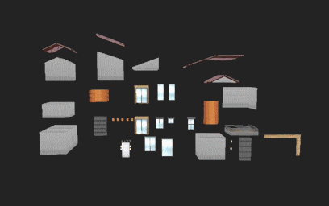

# Houses3K
`Next-Best View Policy for 3D Reconstruction` to be presented at [2020 ECCV Wokshop](http://uavisionvisdrone.com/#/index/home).

*
Peralta, D., Casimiro, J., Nilles, A.M., Aguilar, J.A., Atienza, R., and Cajote, R. "Next-Best View Policy for 3D Reconstruction." European Conference on Computer Vision (ECCV) Workshops, 2020.
*

**Houses3K** is a dataset of 3000 textured 3D house models. Houses3K  is divided into twelve batches, each containing 50 unique house geometries. For each batch, five different textures were applied forming the sets (A, B, C, D, E).

## Modular approach to creating Houses3K

### 3D Modular Pieces

### Assembly

## Download
Houses3K Dataset can be downloaded  [here](https://drive.google.com/drive/folders/1fb5gGBxFIibvHrsJGquO6N8rqKSbkIZB?usp=sharing).

The dataset is in FBX format. You can convert it to other 3D model formats using 3D modelling software like [Blender](https://www.blender.org/) or [Maya](https://www.autodesk.com/products/maya/overview?support=ADVANCED&plc=MAYA&term=1-YEAR&quantity=1).
## Citation

Houses3K was originally used to train and evaluate [Scan-RL](https://github.com/darylperalta/ScanRL). Please cite our paper if you find Houses3K useful to your research.

## [License](LICENSE)
